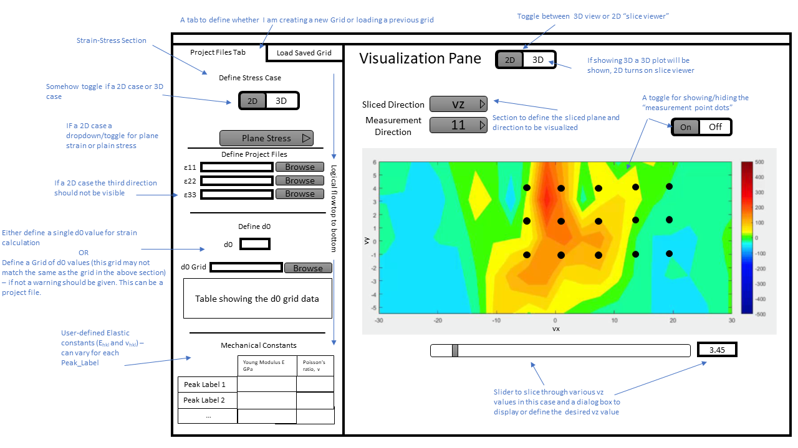
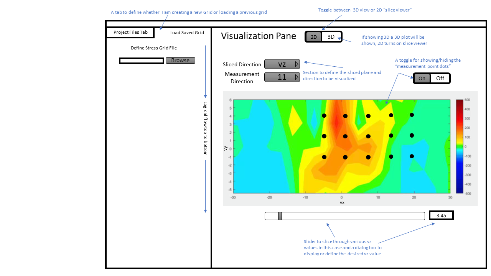
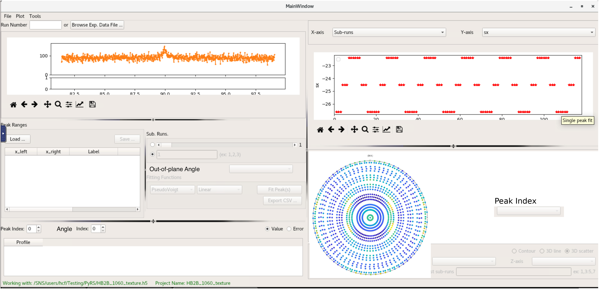

User Story Title: Strain-Stress
=============================

| **ID** | **Complexity** |  **Est.** |  **Author** |
| ------------- | ---------------|-----------|-------------|
| Strain-Stress | Medium | ? | Jeff Bunn |

As a neutron beamline user, I want to create a set of 1D, 2D or 3D data of strain, stress, or peak parameters from measured neutron data such that this set can be visualized, and output to be compared to, or used as, an input for material behavior modeling.

Acceptance Criteria:
--------------------
I will define the HidraProjectFile to be used via a dialog box, each of these project files will contain PeakCollections object and spatial location information (vx, vy, vz, or sx, sy, sz). Additionally I will need to define which Peak_Label (peak object) I wish to utilize. I will then define a case of either 1) all three orthogonal directions (11, 22 and 33) are defined or 2) only two directions. In the case of only two directions I will define whether a ‘plane strain’ or ‘plane stress’ assumption will be utilized. For each direction, a user will select N>1 projects files. PyRS will extract the spatial information (vx,vy,vz by default) and determine the grid that is common across all selected project files. The strain-stress UI will provide an option to redefine the motor positions that are used as the x, y, and z grid. I will be presented with an error if there is a mismatch in grids across the files stating if there are missing points, and what are those points, and their directions. If a different peak_label is selected for multiple directions, I should be given a warning that a label mismatch is detected. If there are multiple points sub runs for the same vx,vy,vz for a direction I should be given an option to define the provenance of the points, whereby I keep a specific set of points, or the points will be 1) averaged, 2) point with lowest strain error, or 3) user selects the specific HidraProjectFile to use. Once the grid is complete and ‘aligned’ PyRS will then calculate the Strain/Stress for each spatial point (vx,vy,vz) and saved into a user defined named stress/strain object. This object should be able to be loaded later for visualization via a separate tab on the same page. I will be given feedback that the process what successful and that the file was saved. Additionally, the option to output a .csv file containing a table of the vx,vy,vz as well as the strain, stress and peak parameters. These parameters will exist for each PeakCollections (peaklabel).

Description, Additional Detail, Context
---------------------------------------
The Strain/Stress formulas can be found at: https://github.com/neutrons/PyRS/blob/master/docs/stress_strain.pdf

User Story Title: Grid Visualization
=============================

| **ID** | **Complexity** |  **Est.** |  **Author** |
| ------------- | ---------------|-----------|-------------|
| Grid-Vis | Medium | ? | Jeff Bunn |

As a neutron beamline user, I want to visualize a set of 2D or 3D data of strain, stress, or peak parameters from measured project files such that this set can be output as a figure or as data to be compared to, or used as, an input for material behavior modeling.

Acceptance Criteria:
--------------------
I will define either files (or a saved grid file) as defined previously in the Strain-Stress user story. A visualization window will visualize the grid data previously calculated by the strain-stress user story. I will define through a drop down the desired peak_label to be visualized.
In the case of 2D/3D data, either a 3D colorized version will be shown as in Fig.1 in additional content. This 3D dataset should be able to be rotated and viewed at various angles.
Furthermore, I should be able to define a specific plane (example being the vx,vy plane) and then use a slider and/or box to enter a value to step through various values of vz to create a 2D contour plot showing the spatial values contained in the grid. An example of what this could look like is shown in Fig.2. I should be able to define via a dropdown menu what direction (11,22, or 33) I wish to be visualized. I should be able to define what peak_label via dropdown (is multiple) I wish to be visualized. I should be able to easily change the scale of the contour map. I should be able to see on the plot ‘dots’ which represent the points in which the measurements were taken (shown in Fig 1 and Fig 2 as example), this showing of ‘measurement dots’ should be able to be toggled via a gui control. I should be able to save an image of any of the above contour plots such that it can be used in presentations and/or publications.
Both the 3D and 2D ‘sliced views’ should be able to visualize any of the parameters which are taken in the grid. These include, Strain, Strain, full-width half maximum, d-spacing, peak intensity, etc. These should also be done for any defined peak_label. An example wireframe layout is shown in Fig.3 below.

Description, Additional Detail, Context
---------------------------------------

Figures below are also saved in the repository

User Story Title: Texture Analysis
=============================

| **ID** | **Complexity** |  **Est.** |  **Author** |
| ------------- | ---------------|-----------|-------------|
| Texture | Low | ? | Chris Fancher |

As a neutron beamline user, I want the ability to extract peak intensities from texture data (raw data reduced by out-of-plan angle) and export these data for further analysis using third-party analysis packages.

Acceptance Criteria:
--------------------
I will define a run number or select a specific project file through the texture UI. I will then specify the peak fitting ranges, background and peakshape functions (using the same mechanisms as the peak_fitting UI). The texture UI will provide an option to switch the peak fit summary bettween different out of plane angles, and plot changes in peak paratmers. The user will either export a csv summary of the peak collections or export a pole figure per peak collection.

Description, Additional Detail, Context
---------------------------------------
The formulas to map extract peak intensity on top a pole figure are shown in: https://github.com/neutrons/PyRS/blob/master/docs/pole_figure.pdf
Figures below are also saved in the repository

User Story Title: PeakInformation CSV Output
=============================

| **ID** | **Complexity** |  **Est.** |  **Author** |
| ------------- | ---------------|-----------|-------------|
| PEAK-CSV-OUT | low |  | Jeff Bunn / Chris Fancher |

As a neutron beamline user, I want to be able to output my data into a readily readable .csv format after I have fit the project file. This file shows all peakcollections in the project file. 

Acceptance Criteria:
--------------------
For the first output, henceforth referred to as PeakInformation, The output is generated by me through pressing of a button in the Peak Fitting GUI. The button is labeled “Export Peak Information.” This button should only be pressable once the user has loaded a project file, and performed a fit of one or more peak ranges in the project file. The format for the output will be .csv and a template for the output file is given below. This PeakInformation file will contain information from only a single, fit, project file. The name of the PeakInformation file will be automatically generated and I will only give the output directory for this file.

Description, Additional Detail, Context
---------------------------------------
PeakInformation Example:

User Story Title: GridInformation CSV Output
=============================

| **ID** | **Complexity** |  **Est.** |  **Author** |
| ------------- | ---------------|-----------|-------------|
| GRID-CSV-OUT | Medium |  | Jeff Bunn / Chris Fancher |

As a neutron beamline user, I want to output my data into a readily readable .csv format after a strain grid has been established in the strain-stress GUI. This datafile will retain the provenance (if multiple subruns share the same vx, vy, vz coordinates) and pedigree (which project file a specific subrun is contained within) of the data.

Acceptance Criteria:
--------------------
After I have established a strain/stress grid in the GUI, I want to be able to output this data into a easily transferrable format, henceforth referred to as GridInformation file. A button in the GUI will say ‘Export Grid Information.’ Also a toggle switch will appear next to the button with the option of either a “summary” or a “detailed.” By default, the “summary” option will be selected. The “detailed” option will only be available for selection if any of the directions contain more than one project file selection. If only one file is selected for each direction then only a summary file can be exported. When I press the ‘Export Grid Information’ I will be presented  with a  dialog box and a file save option will be given. The user will define the filename for the GridInformation file. The summary file will show the grid information from the current selected peak (defined in GUI above) and will contain spatial information on stress and strain. A specified format is detailed below for both the detailed and summary case. 

Description, Additional Detail, Context
---------------------------------------
GridInformation Summary Output Template:
GridInformation Detailed Output Template:

