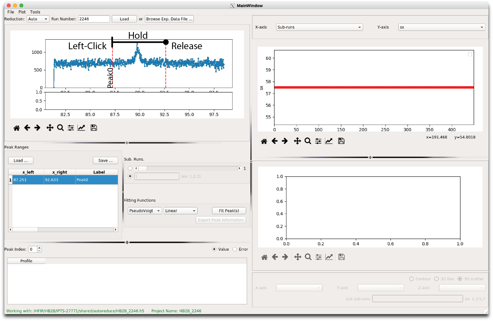
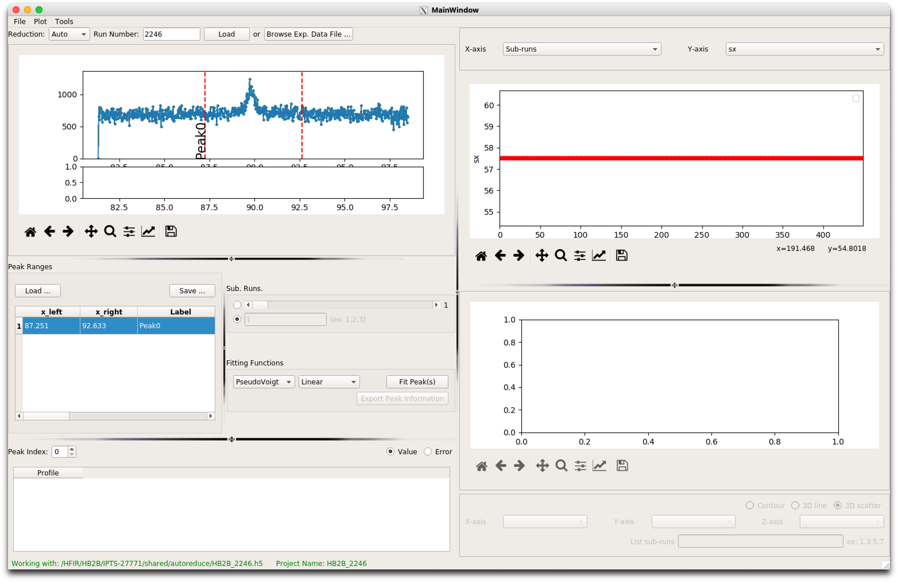
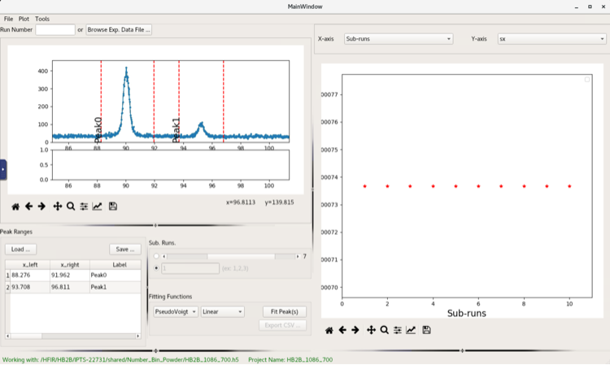
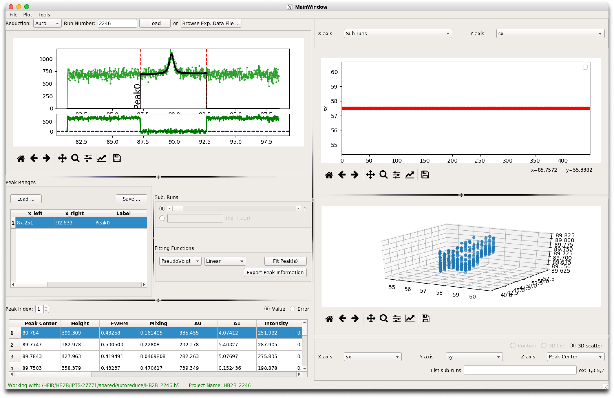

pyRS User Interface
###################

The python Residual Stress (pyRS) software package was developed to analyze diffraction data measured at the high-intensity diffractometer for residual stress analysis. PyRS provides methods to determine the position, width, and height of diffraction peaks in a measured dataset.

Launch the Graphical Interface
==============================

pyRS graphical interface can launched using the pyrsplot executable

.. code-block::

  PYTHONPATH=$PWD:$PYTHONPATH python scripts/pyrsplot

you should be able to see pyRS's MainWindow:

.. image:: ../figures/startup.png
  :width: 400
  :alt: pyrsplot startup window

As listed in the MainWindow, pyrsplot can run 3 different usage modes as described in the next sections.

Data Manual Reduction
=====================

Manual data reduction requires access to raw neutron events stored on ORNL data mounts. The best mechanism to access these data is through analysis.sns.gov. Consult your local contact or the HB2B instrument team for further information about re-reducing data.

Peak Fitting
============

Overview of the pyRS peak fitting UI
------------------------------------

.. image:: ../figures/peak_overview.svg
  :width: 800
  :alt: pyrsplot startup window

Fitting measured data using pyRS
--------------------------------

pyRS was designed to allow the software user to define the peak fitting of data stored using the hidraprojectfile definition. Users interact with the peak fitting UI by defining N ranges for individual peak fitting, where N is the number of windows of interest. Data are loaded by either selecting a specific project file or on the analysis cluster by loading a specific run number. A user defines a peak window interactively in the UI by clicking (and holding) on one side of the peak dragging over the specific peak of interest. The user can tweak the graphically defined window by double clicking on the x_left, x_right, or Label entry in Peak Ranges. Users can export these inputs as a json file for use in later sessions.

Below are examples of peak fits that use a single and multiple fit windows.

After defining the range click "Fit Peak(s)" to launch the analysis.

Results from the peak fitting are visualized on the right using 1D or 2D scatter plots. Users can define what parameters are visualized by changing the 1D or 3D scatter parameters

.. image:: ../figures/visualize_res.png
  :width: 800
  :alt: vis peak fit

Stress Strain Analysis
======================

Select the Stress/Strain Calculation option to launch the stress analysis UI. Reminder overview of the UI interface:

.. image:: ../figures/stress_overview.svg
  :width: 800
  :alt: Stress Analysis overivew

Define the stress condition that pyRS will use to calculate the stresses. A 2D condition allows the selection of either a plane strain or plane stress condition. A 2D condition only prompts loading 2 hidraprojectfiles with peak fit results. Otherwise, a 3D stress condition requires 3 hidraprojectfiles.

  .. image:: ../figures/Stress_Load.png
    :width: 800
    :alt: load project files

After loading 2, or 3, hidraprojectfiles the users need to enter the Mechanical constants (or Materials parameters) Youngs Modulus and Poisson's ratio.

  .. image:: ../figures/Stress_Define_Material.png
    :width: 800
    :alt: define materials

By default the stress/strain framework will use the d0 defined in the peak fitting to determine strains. A constant or spatially varying d0 can be entered at any time after selecting the hidraprojectfiles and entering the materials parameters. Changing the d0 will force the framework to recalculate all strains and stresses.

  .. image:: ../figures/Stress_Define_d0.png
    :width: 800
    :alt: define d0

After defining the Materials properties and d0, the user can now visualize the determine stresses by changing what is plotted (Define Visualization in overview). The user can switch between the 11, 22, and 33 components of the stress/strain.

  .. image:: ../figures/Stress_Final.png
    :width: 800
    :alt: visualize stress strain
