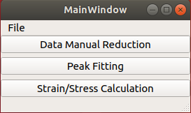
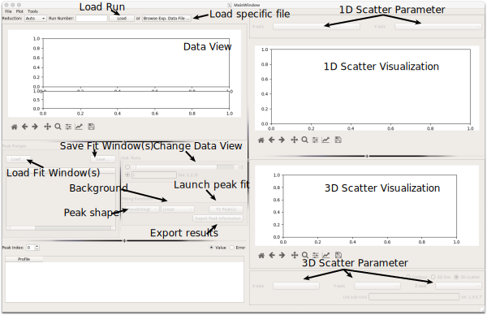
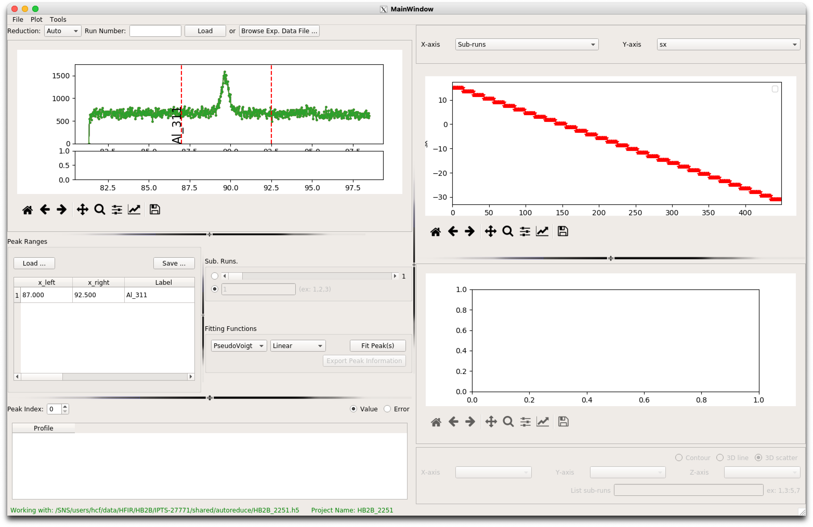
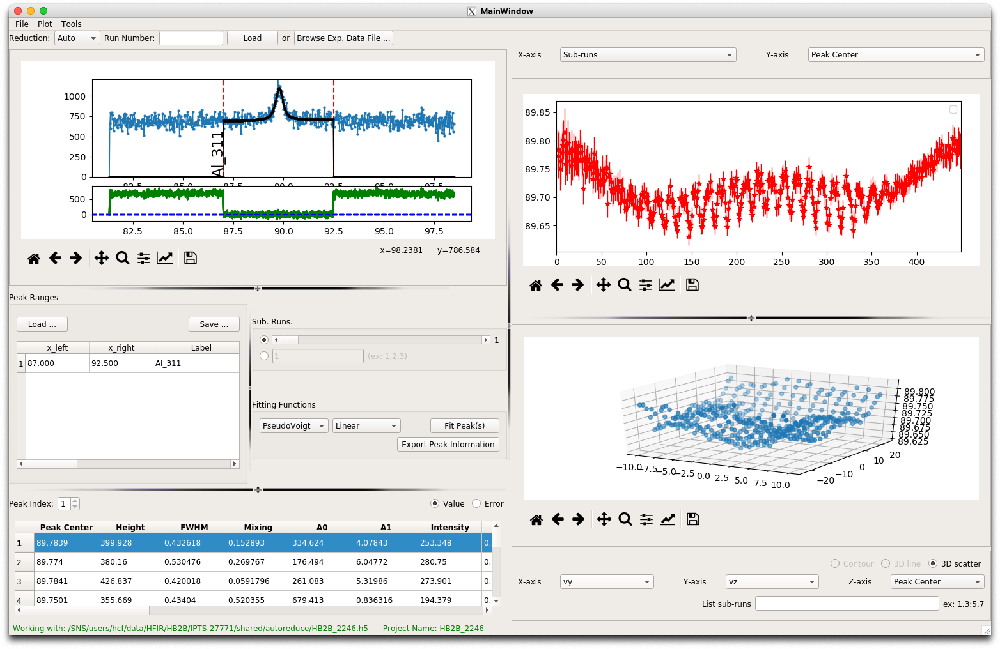
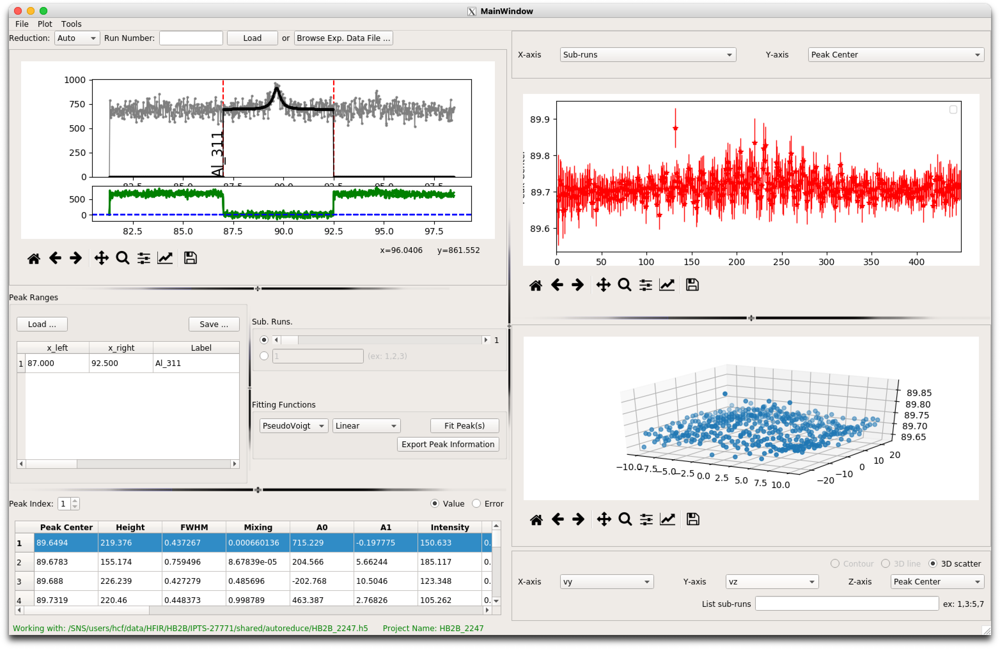

pyRS Example Use
################

Materials processing leaves a characteristic impact on the microstructural and lattice evolution of materials. HIDRA allows materials scientist and research’s with a tool to probe how material joining/manufacturing impacts the residual stress evolution. Often minimizing stresses is critical for advancing manufacturing knowhow. The example here are data measured from a rolled plate of aluminum to demonstrate how materials processing effects stresses in the plate.

Launch pyRS
===========

Launch the pyRS graphical interface to load the peak fitting UI.

.. code-block::

  PYTHONPATH=$PWD:$PYTHONPATH python scripts/pyrsplot

Peak Fitting
============

Select the peak fitting option to launch the peak fitting UI. Reminder overview of the UI interface:

Load measured data
------------------
After the UI loads, select the "Browse Exp. Data File" to select one of the three hidraprojectfiles in the examples folder "HB2B_2246.h5, HB2B_2247.h5, and HB2B_2251.h5". These three files represent data for the LD, TD, and ST directions.

Fitting measured data using pyRS
--------------------------------

Graphically define a fit window over the peak of interest. Double click in the x_left (87.0), x_right (92.5), and Label (Al_311). Save the fit range for later use. See below for an example of what the UI should look like before Fitting. After saving the range, click the "Fit Peak(s)" button to start the peak fitting process.

Below are examples of peak fits that use a single an multiple fit windows.

.. image:: ../figures/Fit_2251.png
  :width: 800
  :alt: Fit of run 2651

Save Project Files
------------------
After fitting, save the results using either "File/Save" or "File/Save As" to save a new hidraprojectfile. Note that the hidraprojectfiles are not write protected and you can overwrite prior peak fitting results.

Stress Analysis
===============

Select the Stress/Strain Calculation option to launch the stress analysis UI. Reminder overview of the UI interface:

.. image:: ../figures/stress_overview.svg
  :width: 800
  :alt: Stress Analysis overivew

Load Project Files
------------------
Load the HB2B_2246.h5 as e11, HB2B_2247.h5 as e22, and HB2B_2251.h5 as e33.

  .. image:: ../figures/Stress_Load.png
    :width: 800
    :alt: load project files

Define Material Parameters
--------------------------

Enter 174 as the Youngs Modulus and 0.3 Poisson's ratio.

  .. image:: ../figures/Stress_Define_Material.png
    :width: 800
    :alt: define materials

A d0 was not defined in during peakfitting (see above). Enter 1.2215 as the d0 with 0 as the estimated standard deviations.

  .. image:: ../figures/Stress_Define_d0.png
    :width: 800
    :alt: define d0

After defining the Materials properties and d0, the user can now visualize the determine stresses by changing what is plotted (Define Visualization in overview). The user can switch between the 11, 22, and 33 components of the stress/strain.

  .. image:: ../figures/Stress_Final.png
    :width: 800
    :alt: visualize stress strain

Figures of the data can be exported for use in reports, or the stress/strain grid can be exported and plotted outside of pyRS.
