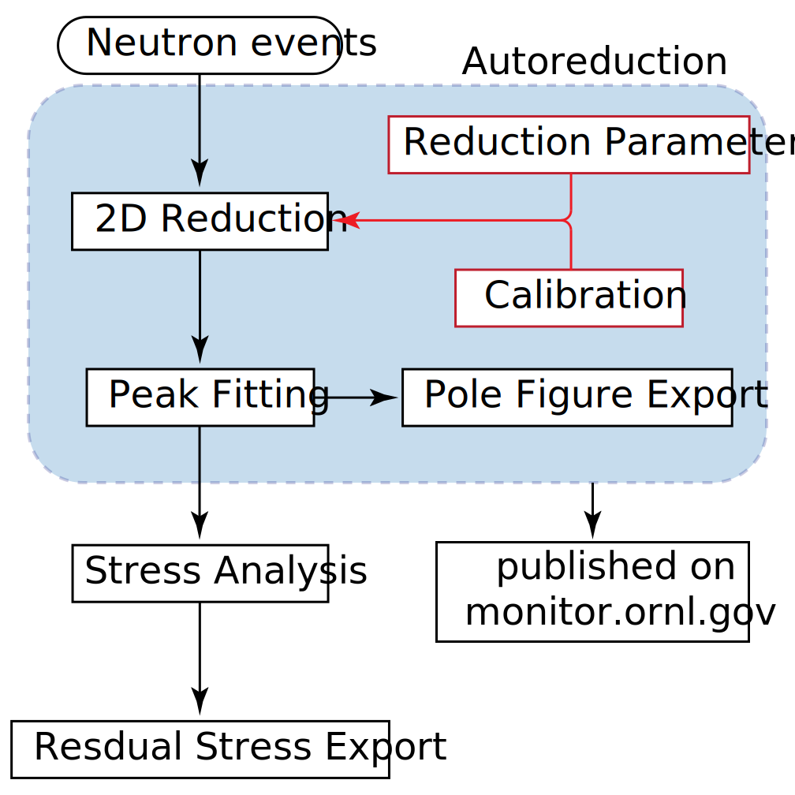

############
Introduction
############

The python Residual Stress (pyRS) analysis software was designed to address the data reduction and analysis needs of the High-Intensity Diffractometer for Residual stress Analysis (HIDRA) user community.
pyRS implements frameworks for the calibration and reduction of measured 2D data into intensity vs scattering vector and subsequent single-peak fitting analysis to facilitate texture and residual strain/stress analysis.
pyRS components are accessible as stand-alone user interfaces for peak fitting and stress/strain analysis or through python scripts.
The scripting interface facilitates automated data reduction and peak-fitting analysis using an autoreduction protocol.

pyRS was designed as a flexible software package that incorporates separate modules for 2D reduction, peak analysis, and stress analysis.
These modules provide a streamlined workflow for the reduction of raw neutron events into 1D intensity vs scattering angle and subsequent analysis to extract the interatomic spacing and/or intensity for subsequent residual stress and texture analysis.
A high-level workflow that highlights the interconnection between modules is shown in Figure 1.
Note that the blue shaded region represents modules available to the autoreduction platform for automated analysis.
pyRS saves data into a single hdf5 file to streamline data storage by storing metadata, reduced diffraction data, and peak analysis results within a single hdf5 file (named HiDRA project file) that is passed between different modules.

Installation
############

Using a Conda Environment
=========================

pyRS preferred method is to create a conda environment with the required Python dependencies.
Follow these steps:

1. Install basic dependencies: `Conda <https://docs.anaconda.com/anaconda/install/>`_, Python 3, and PyQt
2. Create a new Conda environment with additional dependencies:

.. code-block::

   $ conda create -n pyrs -c mantid -c mantid/label/nightly mantid-workbench -c conda-forge  --file requirements.txt --file requirements_dev.txt

3. Activate the conda environment

.. code-block::

   $ conda activate pyrs

.. caution::

   Do not update this newly created environment as some dependencies might not be backwards compatible.
